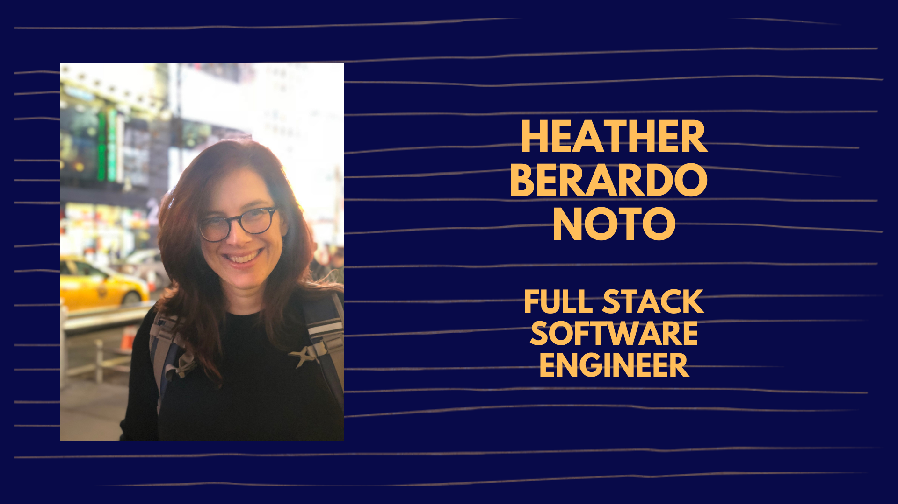

    
 
 # Hi, I am...
 
* based in the NYC metro area 🏙️
* a full stack software engineer focused on the NERD stack. 🤓
* currently, I'm working on an updated portfolio. 🎨
* expanding my skills.  I'm learning about cloud storage and GraphQL and working my way through AlgoExpert.🏫
* **always** listening to music. I am currently listening to Crumb. 🎵
* playing with my 🐶, reading 📚, and hanging with my 👪 when I am not coding. 💻

### Fun Fact About Me:
In my senior year of high school, I took a career aptitude test. The nun that ran the guidance office (it was a Catholic school) was very excited because I only had one result show up.  Because these were the olden days, she had to look up the given code to find out what my *perfect* career path would be. She told me that she had never seen a student get only one career as an option from the test, usually it provided a few. I must have found my calling! We both bent over the book, excited to find the match.  What??? Confusion. Looking at each other. Circus performer??  Checking to make sure we used the right code. Yup, circus performer. 😆

## 🔧 Technologies and Tools
               

## Want to know more? 

#### Head to my [portfolio](https://heather-berardo-noto.netlify.app/) for some demos 
#### Visit my [LinkedIn](https://www.linkedin.com/in/heather-berardo-noto/)
#### Contact me at heather.noto@gmail.com ✉️

## Resume 

Click To Expand

# Heather Berardo Noto
## Full Stack Engineer
### New York, NY | (516) 428-1438 
#### Heather.Noto@gmail.com 
#### [LinkedIn](https://www.linkedin.com/in/heather-berardo-noto/) | [Portfolio](https://heather-berardo-noto.netlify.app/) | [GitHub](https://github.com/heathernoto)

## Education
### Grace Hopper at Fullstack Academy
*10/2020 - 2/2021*
- 17-Week full stack immersive web development course
### Stony Brook University
*08/1987 - 05/1991*
- B.A. in Social Sciences Interdisciplinary and Child and Family Studies

## Technical Projects
- Grace Hopper Program at Fullstack Academy*
### Pin It https://pin-it-reader.herokuapp.com 
*02/2021 - 02/2021* 
- Web app to store articles for on and offline reading. Capstone project written with three fellow students*
- Automated collection of user-specified articles using Puppeteer’s web scraping functionality
- Built RESTful APIs with Express to handle CRUD operations to Cloudant and local PouchDB storage
- Built Redux store to manage state using Axios to enable the front end to communicate with database
- Deployed app with Heroku
- Added category feature to article input form to enable sorting by topic
### Black Mirror Fortune Teller https://github.com/heathernoto/MagicMirror 
 *02/2021 - 02/2021*
- Novelty fortune telling app built as a solo hack-a-thon project*
- Implemented React Native to use mobile device’s functionality
- Integrated Expo Camera and Facial Detection APIs
- Generated fortunes using facial detection data to dictate prediction type
- Styled app with CSS and displayed fortune using animation 
### Tranquility https://tranquility-candles.herokuapp.com 
*01/2021 - 01/2021* 
 - A mock e-commerce site built within a week with two fellow students*
- Constructed user database model, hooks, and instance methods using Sequelize
- Coded REST APIs with Node.js and Express for managing candle data in PostgreSQL database
- Implemented Redux store with Axios HTTP requests to fetch data and supply to the front end
- Created React components to display multiple and single candle views
- Styled components with Flexbox and CSS 

## Prior Experience
### Treasurer, Executive Board, Port Summer Show
*12/2019 - current*
- Volunteer position at non-profit that produces a professionally directed and choreographed summer theater experience available to local teens while enriching the community
- Established electronic donations to maximize contributions and simplify bookkeeping
- Collaborate on strategic planning, hiring and compensation of all contract employees, show logistics, grant writing, fundraising, and pivot to online content for Covid-19
- Manage funds and bookkeeping, tax preparation, and annual budget
### Primary Caregiver/Community Involvement
*08/1998 - 10/2020*
- Organized and coordinated varied needs of children and elderly family members while volunteering in the local community
### Head Teacher, Computer Associates Child Development Center
*02/1992 - 08/1998*
- Trained and supervised assistant teachers in an NAEYC Accredited Early Childhood Program while evaluating children’s development and helping them achieve developmental milestones
- Facilitated positive communication between families and classroom staff 

## Skills
JavaScript, React, Redux, HTML, CSS, Node.js, Git/GitHub, Express, Sequelize, PostgreSQL, Material-UI, Puppeteer, React Native, Expo Camera/Face Detector

<!--
**heathernoto/heathernoto** is a ✨ _special_ ✨ repository because its `README.md` (this file) appears on your GitHub profile.

Here are some ideas to get you started:

- 🔭 I’m currently working on ...
- 🌱 I’m currently learning ...
- 👯 I’m looking to collaborate on ...
- 🤔 I’m looking for help with ...
- 💬 Ask me about ...
- 📫 How to reach me: ...
- 😄 Pronouns: ...
- ⚡ Fun fact: ...
-->
